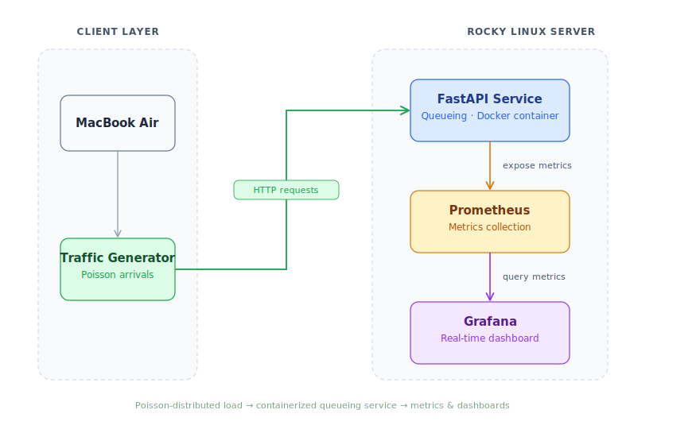

# Latency-SLO Capacity Planning Using Queueing-Theory Digital Twins for Network Services

A queueing-theory-based digital twin used to analyze latency behavior, validate service-level objectives (SLOs), and estimate network service capacity limits using real measurements collected from a live deployment.

## Architecture

## System Architecture

The system models realistic, bursty traffic against a containerized queueing service and observes its behavior end to end. A client generates Poisson-distributed load, a FastAPI service handles requests inside Docker, and Prometheus + Grafana capture and visualize the metrics.

<p align="center">
  
</p>

### Components

| Component | Role |
|-----------|------|
| **Client Node** | MacBook Air running the load-generation script |
| **Traffic Generator** | Emits requests with exponential inter-arrival times (a Poisson process) to simulate realistic, bursty load |
| **FastAPI Queueing Service** | Containerized service under test; processes incoming requests through a queue |
| **Prometheus** | Scrapes and stores the time-series metrics exposed by the service |
| **Grafana** | Dashboards for queue depth, latency, and throughput under load |

### Data Flow

1. The **client** starts the traffic generator.
2. The generator fires **HTTP requests** at Poisson-distributed intervals against the FastAPI service.
3. The service exposes runtime **metrics**, which Prometheus scrapes on a fixed interval.
4. **Grafana** queries Prometheus and renders live dashboards of system behavior under load.
## Key Results

| Metric                  | Value               |
| ----------------------- | ------------------- |
| Servers (c)             | 2                   |
| Service Rate (μ̂)       | 20.323 req/s/server |
| Capacity                | 40.65 req/s         |
| SLO Target              | 100 ms              |
| Predicted λmax          | 28.97 req/s         |
| Little's Law Validation | Successful          |

## Technology Stack

### Infrastructure
- Rocky Linux 9
- Docker
- Docker Compose

### Monitoring
- Prometheus
- Grafana

### Application
- FastAPI
- Python

### Performance Engineering
- Queueing Theory (M/M/c)
- Little's Law
- SLO Capacity Planning

## Repository Structure

```text
service/        FastAPI queueing service
loadgen/        Poisson traffic generator
experiments/    Analysis and capacity-planning scripts
monitoring/     Prometheus and Grafana configuration
results/        Experimental outputs and figures
```

## Sample Outputs

* Latency vs Load Curve
* Little's Law Validation
* SLO Capacity Prediction
* Real-Time Grafana Dashboard
