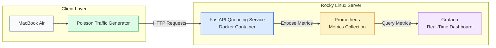

# Latency-SLO Capacity Planning Using Queueing-Theory Digital Twins for Network Services

A queueing-theory-based digital twin used to analyze latency behavior, validate service-level objectives (SLOs), and estimate network service capacity limits using real measurements collected from a live deployment.

## Architecture
## 🏗️ System Architecture



## Key Results

| Metric                  | Value               |
| ----------------------- | ------------------- |
| Servers (c)             | 2                   |
| Service Rate (μ̂)       | 20.323 req/s/server |
| Capacity                | 40.65 req/s         |
| SLO Target              | 100 ms              |
| Predicted λmax          | 28.97 req/s         |
| Little's Law Validation | Successful          |

## Technology Stack

### Infrastructure
- Rocky Linux 9
- Docker
- Docker Compose

### Monitoring
- Prometheus
- Grafana

### Application
- FastAPI
- Python

### Performance Engineering
- Queueing Theory (M/M/c)
- Little's Law
- SLO Capacity Planning

## Repository Structure

```text
service/        FastAPI queueing service
loadgen/        Poisson traffic generator
experiments/    Analysis and capacity-planning scripts
monitoring/     Prometheus and Grafana configuration
results/        Experimental outputs and figures
```

## Sample Outputs

* Latency vs Load Curve
* Little's Law Validation
* SLO Capacity Prediction
* Real-Time Grafana Dashboard
